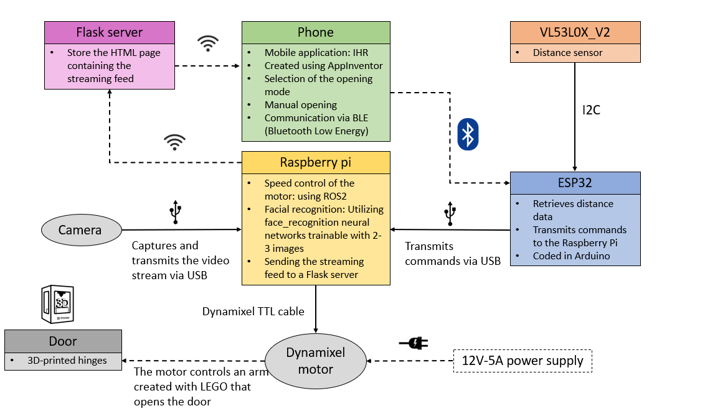

# Facial Recognition Door Project

## Project Description

We are a team of three students from CPE Lyon: Adrien Pouxviel, Arnaud Ville, and Clément Poirié. Our goal is to realize the prototype of a solution according to a predefined list of materials and instructions which answer the following problematic found by our group: **How can we optimize the safety of automatic doors while ensuring greater inclusion of people with disabilities?**

The list of elements to be used is as follows:

- Implementation of an ESP32
- Integration of a distance sensor
- Use of a dynamixel motor
- Programming with the ROS2 middleware
- Development of a mobile application

The allocated time for the completion of this project spanned over a period of 20 hours. Our approach is to create a door equipped with a facial recognition system, thus allowing exclusive access to authorized individuals. Facial recognition serves as the authentication mechanism necessary for unlocking the door. Additionally, we have incorporated features such as the presence detection opening mode and the opening mode via phone command.
This project enables us to explore all aspects of a robotic system: the hardware, embedded programming and AI management (incorporating facial recognition)

## Features

- **Facial Recognition:** Implementation of a facial recognition algorithm aimed at accurately identifying authorized individuals.
- **Distance Sensor:** Integration of a sensor to determine the presence or absence of a person in front of the door.
- **IHR Mobile Application:** Design of a mobile application acting as a human-machine interface. It allows remote opening and closing of the door, streaming camera feed visualization, and modification of the opening mode between facial recognition and presence detection.

## Technologies Used

- **Programming Languages :** Python and Arduino
- **Middleware :** ROS2 Humble
- **Libraries :**
    - OpenCV for image capture and image processing.
    - face_recognition for facial detection and recognition.
- **Server :**
    - Flask server
- **Hardware :**
    - A camera
    - A PVC plate specifically resized for the door creation.
    - Custom hinges designed and printed by us using a 3D printer.
    - A VL53L0X-V2 distance sensor.
    - An Ax12 dynamixel motor.
    - Lego bricks


## The system


The core of our system is the Raspberry Pi, which controls the motors based on the mode sent by the ESP32 and handles facial recognition. The streaming flow is displayed on an HTML page, which is sent in real-time to a Flask server (locally). The phone, serving as the IHR (In-Home Receiver), connects to this server, providing a live camera feed on the phone. Additionally, the user can control the opening and closing of the system through the application, as well as choose the mode (facial recognition, presence detection, manual). All this information is transmitted via Bluetooth to the ESP32. The ESP32 manages the distance sensor and sends all the information to the RaspberryPI

## How to launch

To install and launch the project, follow these steps:
 - install the mobile application *(/AppMobile/ProtoROB.apk)* on an Android device
 - go into */commande_moteur*, then build and install the ros package:
```bash
colcon build
source install/setup.bash
```
 - launch the project:
```bash
ros2 launch dynamixelAx12 launch.py
```
 - connect to the ESP32 in bluetooth thanks to the application on your Android device

## Results

You can see how our automatic door works in the video here: [video link](https://www.youtube.com/watch?v=eF3JlMnl-vE)
This video will show the 3 different modes available at this moment ad 

Here is a photo of the final version of the project:


## Authors

- Clément POIRIE
- Adrien POUXVIEL
- Arnaud VILLE

Supervising teacher: Sébastien ALTOUNIAN
